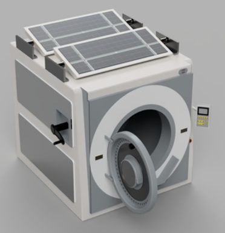

# Novel-Washing-Machine-Design

This repository contains all of the relevant files for the project entitled: Design for a Specialist Washing Machine for use in Refugee Camps. This project was named as amongst the top 10% of research projects at Queen Mary in 2021, and was nominated to present in front of a panel of expert judges at the Queen Mary Project Showcase.

## Using this repository
The final report can be read with any standard PDF reading software. However, there are a number of other external files that have been included for completeness. These files require specific software to access:

- The files *SolarPanelMotorParams* and *sunPositionData* will both require MATLAB to run. The file *ControlSystemDesign* will not only require MATLAB to be installed, but the extension SIMULINK is also required for this file to run.
- The files *M1_Calculation* and *M2_Calculation* were made using EduPack Software, and so some version of this software (preferably 2020 or more recent) is required.
- The file *CAD_Drawing* was made using the software Autodesk Fusion 360, however any standard CAD software should function fine.

---------------------------------------------------------------------------------------------------------
With thanks to Queen Mary University of London and the [Washing Machine Project](https://www.thewashingmachineproject.org) for their help and support throughout this project. 

